# 樹莓派系統安裝在USB/SSD硬碟

* 硬體：pi4
* 相關連結
    * 安裝image 到硬體的軟體：[網站連結](https://www.raspberrypi.com/software/)
    * 下載image 的網站：[網站連結](https://www.raspberrypi.com/software/operating-systems/)

---
## 本篇文章是紀錄在樹莓派4上使用SSD當儲存空間的方法，總共3個步驟

### 步驟1 : 安裝相關軟體與映像檔
* 下載安裝image 到硬體的軟體
* 下載image
    * 64位元，有桌面版本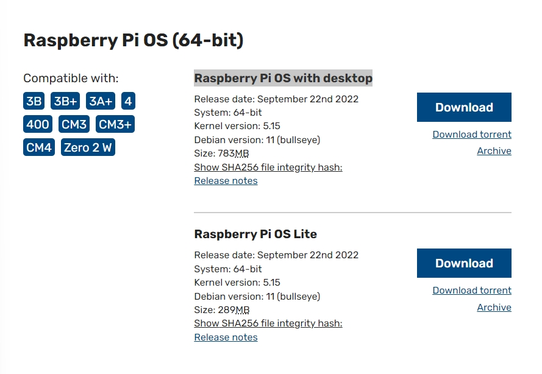
### 步驟2 ： 將Image安裝到USB/SSD
* 選擇你下載的Image
    * 選自定義鏡像檔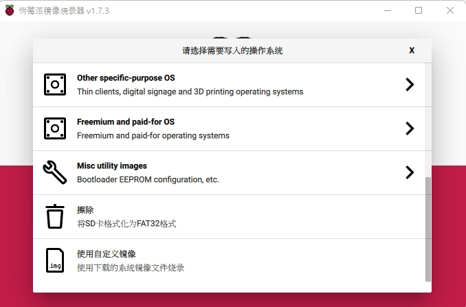
    * 選擇下載好的映像檔選擇你的裝置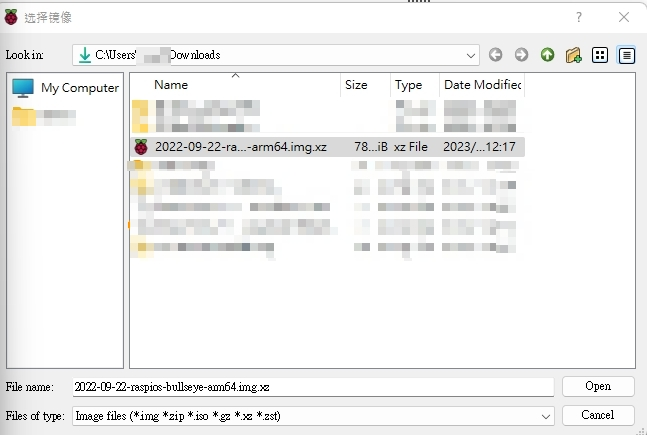
    * 選擇你要使用的USB/SSD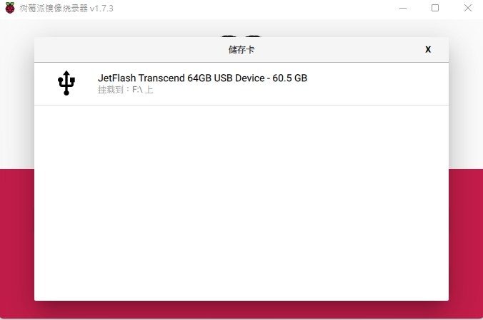
    * 設定相關設定(wifi/使用者名稱密碼/SSH)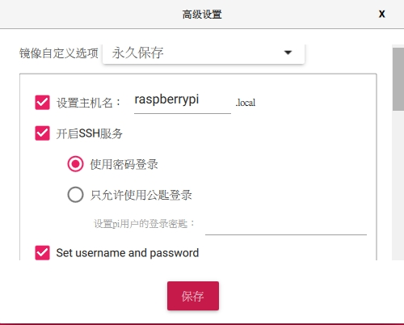
    * SSH使用者名稱密碼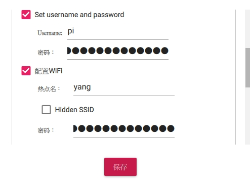
    * WIFI時區與其他設定開始燒錄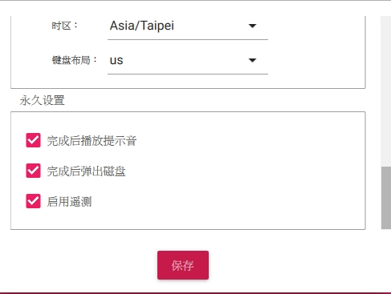
    * 燒錄完成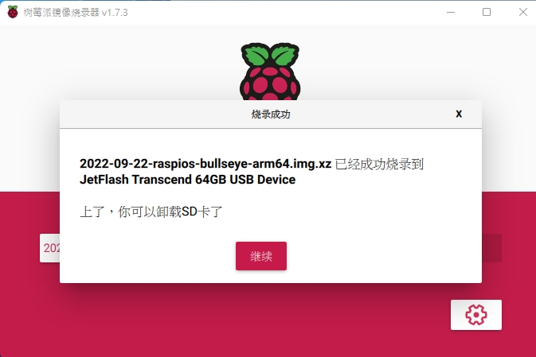
### 步驟3 ： 連接USB 3接口
* 正常執行
    * 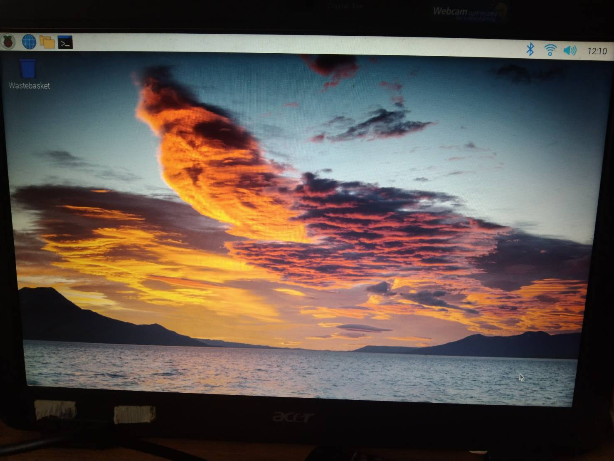
* 如果步驟3錯誤如下
    * 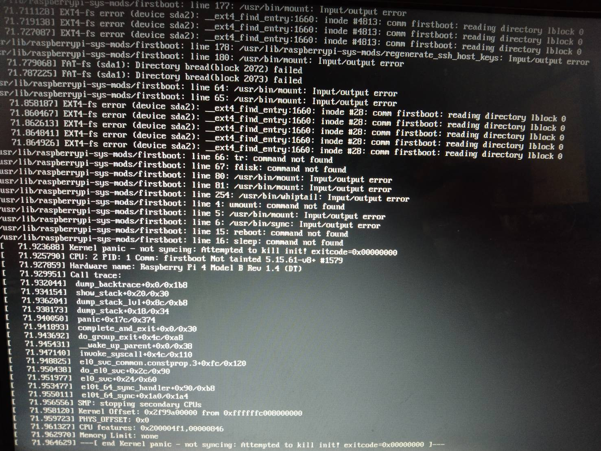
    * 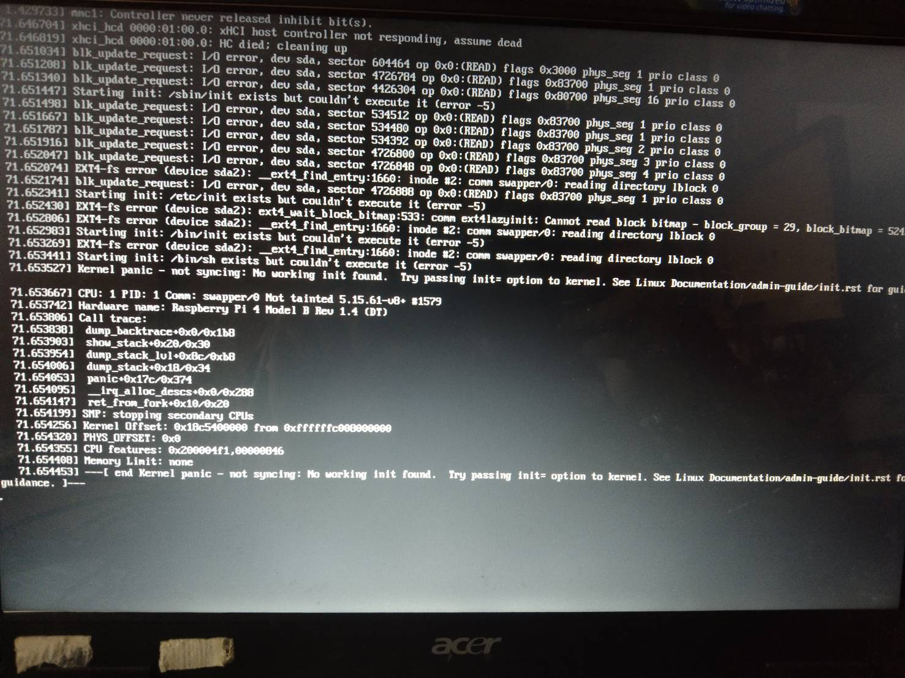
* 無法正常執行無法正常執行可嘗試以下步驟
* 先將接口轉到USB2看是否可以執行
* 設定對應的開機區塊
    * 查看USB/SSD的裝置id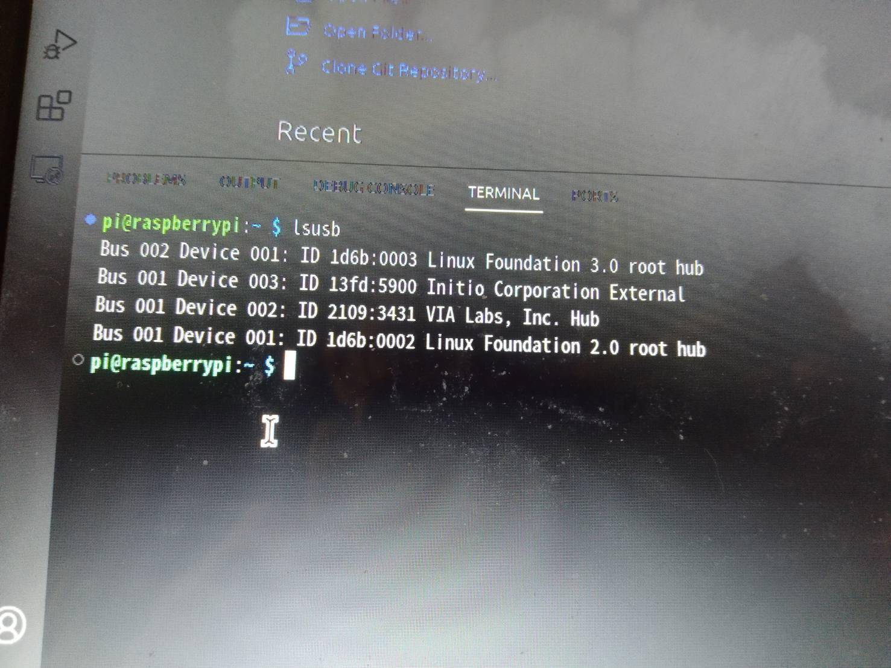
    * 設定開機區塊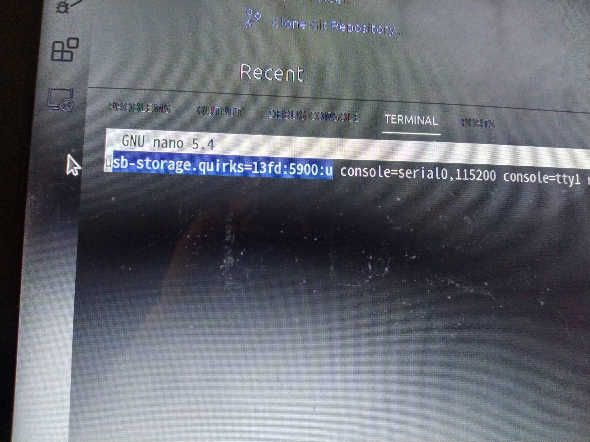
* 設定完再將接口移動到USB3接口，重新啟動樹莓派
---
以上就是本次文章的主要內容，將pi4儲存裝置換成SSD後你可以發現速度快很多，雖然不能達到一般SSD的速度，但也比一般SD卡或USB3隨身碟快很多，我覺得使用SSD是一個性價比不錯的方案。

如有任何疑問可以在下面留言